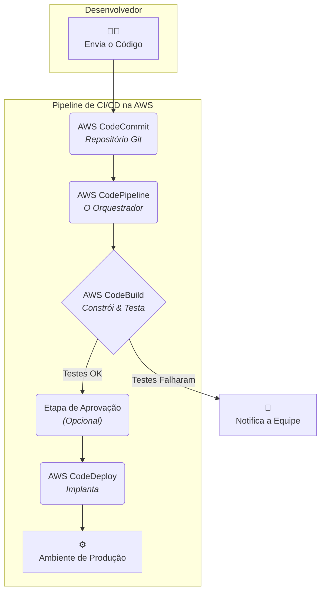

#  DevOps: Derrubando Muros para Construir Software Melhor e Mais Rápido

No mundo tradicional da tecnologia, existia um grande muro entre duas equipes com objetivos opostos.

* **Analogia:** Pense em um restaurante.
    * ** A Equipe de Desenvolvimento (Dev):** São os **"Chefs de Cozinha"**. O objetivo deles é **INOVAR**: criar pratos novos e empolgantes o mais rápido possível. Eles se preocupam com a velocidade da criação.
    * ** A Equipe de Operações (Ops):** São os **"Gerentes do Salão e Garçons"**. O objetivo deles é a **ESTABILIDADE**: garantir que cada prato chegue perfeito à mesa, que o serviço nunca pare e que os clientes fiquem satisfeitos. Eles se preocupam com a confiabilidade.

**A Dor (O Muro da Confusão):**
O Chef (Dev) criava um prato incrível, testava na sua bancada e gritava: "Funciona!". O Garçom (Ops) pegava o prato, corria para o salão, mas no caminho ele esfriava e o molho virava. O cliente reclamava, e o garçom culpava o chef, que por sua vez culpava o garçom. O resultado era um serviço lento, cheio de erros e clientes insatisfeitos.

**DevOps é a revolução que derruba o muro entre a cozinha e o salão.**

---

###  O que é DevOps?

DevOps é uma **cultura**, suportada por práticas e ferramentas, que une as equipes de Desenvolvimento (Dev) e Operações (Ops). O objetivo é simples: **entregar valor ao cliente final de forma mais rápida, frequente e confiável.**

Chefs e garçons agora trabalham juntos, com o mesmo objetivo: a experiência do cliente.

#### A Mudança de Metodologia: Da Cachoeira ao Agile

* **Waterfall (Cachoeira):** O "banquete anual". Planeja-se tudo por um ano, e o produto é entregue de uma só vez no final. Lento, arriscado e sem feedback.
* **Agile:** Entregar "pequenos pratos" (sprints) a cada duas semanas, recebendo feedback constante do cliente e ajustando a receita.
* **DevOps:** É a cultura e a automação que permitem que o modelo **Agile** funcione em alta velocidade e em grande escala com segurança.

---

###  Os 5 Pilares da Cultura DevOps (CALMS)

DevOps é guiado por cinco princípios culturais, conhecidos pelo acrônimo CALMS.

1.  ** C - Cultura (Culture):**
    * É sobre **derrubar os muros**. Promove a colaboração, a confiança e a responsabilidade compartilhada. O sucesso ou a falha do "prato" é de todos.

2.  ** A - Automação (Automation):**
    * Automatize tudo que for repetitivo para eliminar erros humanos e acelerar os processos.
    * **Analogia:** Usar uma **"esteira rolante automatizada"** para levar o prato da cozinha à mesa, em vez de um garçom correndo.

3.  ** L - Lean (Enxuto):**
    * Foco em entregar valor em pequenos lotes.
    * **Analogia:** Em vez de preparar um banquete de 10 pratos, entregue um prato de cada vez, pegue o feedback, e só então prepare o próximo. Isso reduz o desperdício e permite correções rápidas de curso.

4.  ** M - Medição (Measurement):**
    * "O que não pode ser medido, não pode ser melhorado".
    * **Analogia:** Colocar sensores em cada etapa: qual o tempo de preparo do prato? Qual a temperatura dele ao chegar à mesa? Qual a nota de satisfação do cliente? Use dados para tomar decisões.

5.  ** S - Compartilhamento (Sharing):**
    * O feedback flui livremente e de forma transparente entre todas as equipes. O garçom (Ops) não esconde a reclamação do cliente; ele a leva diretamente ao chef (Dev) para que a receita seja aprimorada.

---

###  DevOps em Ação na AWS: A Esteira Automatizada (CI/CD)

A principal manifestação técnica do DevOps é a **CI/CD (Integração e Entrega Contínua)**. A AWS oferece um conjunto de ferramentas de desenvolvedor para construir essa "esteira" automatizada.

1.  ** AWS CodeCommit (O Livro de Receitas):**
    * É o repositório Git onde os "chefs" (desenvolvedores) escrevem e guardam suas "receitas" (o código-fonte).

2.  ** AWS CodeBuild (A Estação de Teste):**
    * É o "robô" que pega a receita, prepara o prato (compila o código) e faz um "teste de sabor" automatizado (executa os testes de unidade) para garantir a qualidade.

3.  ** AWS CodeDeploy (O Robô de Entrega):**
    * É o robô que pega o prato aprovado e o entrega de forma segura e padronizada na "mesa do cliente" (seus servidores EC2, contêineres ou funções Lambda).

4.  ** AWS CodePipeline (A Esteira Rolante):**
    * É o serviço que **orquestra todo o processo**. Ele detecta uma nova receita no CodeCommit, a envia para o CodeBuild para testar, e depois para o CodeDeploy para entregar, automatizando todo o fluxo do início ao fim.

> ** HACK PARA CERTIFICAÇÃO:** Para a prova Cloud Practitioner, entenda o **objetivo** do DevOps (aumentar a velocidade e a confiabilidade). Saiba que a **CI/CD** é a sua principal prática técnica. E, o mais importante, conheça a **finalidade** de cada serviço do kit de ferramentas de desenvolvedor da AWS: **CodeCommit** (guardar código), **CodeBuild** (construir/testar), **CodeDeploy** (implantar) e **CodePipeline** (orquestrar).

---

###  O Coração da Revolução: Como a Cultura Define o Sucesso do DevOps

Você pode ter a melhor esteira de automação (CI/CD) do mundo e os melhores "chefs" (desenvolvedores) e "garçons" (operações). Mas se a filosofia de gestão do restaurante for rígida, burocrática e baseada na desconfiança, a revolução DevOps morrerá na praia.

**O Insight Fundamental:** DevOps não é um conjunto de ferramentas que você instala. É uma **transformação cultural**. A cultura de uma organização é o seu "sistema operacional" humano; ela dita como as pessoas se comunicam, colaboram e resolvem problemas. Ela pode ser seu maior aliado ou seu maior inimigo.

Vamos analisar os quatro tipos de cultura organizacional e como cada uma delas interage com a filosofia DevOps.

---

###  O Campo de Jogo: Os 4 Tipos de Cultura

####  1. A Cultura Colaborativa (A Cozinha Aberta)
* **Como é?** O foco é no trabalho em equipe, na comunicação e no consenso. Pessoas são o centro de tudo.
* **Analogia:** O dono do restaurante promove um ambiente de **"cozinha aberta e equipe unida"**. Chefs e garçons se reúnem diariamente para discutir o feedback dos clientes e melhorar os pratos juntos.
* **Relação com DevOps:** **Combustível Natural.** Esta cultura é o terreno mais fértil para o DevOps. A colaboração e o compartilhamento de responsabilidades já existem. O DevOps apenas fornece as ferramentas de automação para turbinar essa colaboração e acelerar a entrega de valor.

####  2. A Cultura Adhocrática (A Cozinha Experimental)
* **Como é?** O foco é na inovação, na criatividade e em assumir riscos. É um ambiente dinâmico e empreendedor.
* **Analogia:** O dono é um **"chef-celebridade-inovador"**. O restaurante é famoso por criar pratos novos e disruptivos toda semana. O fracasso de um prato é visto como uma oportunidade de aprendizado.
* **Relação com DevOps:** **Grande Aliada.** O DevOps fornece a **"rede de segurança"** (testes e implantação automatizados) que permite que a equipe inove e experimente com muito mais velocidade e com um risco muito menor. Se a nova receita não funcionar, é possível reverter para a anterior com um clique.

####  3. A Cultura de Mercado (A Cozinha Competitiva)
* **Como é?** O foco é em resultados, metas, market share e em vencer a concorrência a todo custo. É altamente competitiva e orientada a métricas.
* **Analogia:** O dono é um **"tubarão dos negócios"**. O objetivo principal é "vender mais que o restaurante do outro lado da rua".
* **Relação com DevOps:** **Pode ser um motor poderoso ou um obstáculo.**
    * **Se a meta for "velocidade de entrega de novas features"**, o DevOps será visto como uma arma estratégica e será fortemente incentivado.
    * **Se a meta for apenas "redução de custos a curto prazo"**, a cultura pode resistir ao investimento inicial necessário para automação e treinamento, vendo-o como uma despesa e não como um investimento.

####  4. A Cultura Hierárquica (A Cozinha de Fast-Food)
* **Como é?** O foco é na estabilidade, nos processos, na eficiência e no controle. A estrutura é rígida, e a comunicação é de cima para baixo.
* **Analogia:** O dono é um **"gerente de fast-food tradicional"**. Existe um manual de 500 páginas para cada tarefa, e ninguém pode desviar do processo.
* **Relação com DevOps:** **O Maior Desafio.** Esta cultura é o oposto da filosofia DevOps. Os "muros" entre os departamentos (silos) são altos e reforçados. Uma transformação DevOps aqui é possível, mas exige um **patrocínio executivo (do "dono da franquia") muito forte** para quebrar as barreiras, redesenhar os processos e promover a colaboração entre as equipes.

> ** HACK PARA CERTIFICAÇÃO:** Para a prova Cloud Practitioner, o conceito de **Cultura** é a primeira letra e o pilar mais importante do framework **CALMS** do DevOps. Eles esperam que você entenda que DevOps **não é um cargo ou uma ferramenta, mas uma mudança cultural** que visa quebrar os silos entre as equipes de Desenvolvimento e Operações.

> ** INSIGHT DE ESPECIALISTA (Segurança Psicológica):** Nenhuma empresa é 100% um único tipo de cultura. O ingrediente secreto para qualquer transformação DevOps bem-sucedida é a **Segurança Psicológica**. É a criação de um ambiente onde as pessoas se sentem seguras para experimentar, admitir erros, dar feedback honesto e colaborar sem medo de punição. Sem isso, a automação é apenas uma ferramenta vazia.

---

###  A Esteira da Inovação: Guia Prático de Automação com CI/CD

No guia anterior, vimos que o DevOps é uma cultura para "derrubar o muro" entre a cozinha (Desenvolvimento) e o salão (Operações). Mas como, na prática, garantimos que um "prato" (uma nova feature) saia da cozinha e chegue à mesa do cliente de forma rápida, consistente e sem esfriar no caminho?

A resposta é a **Automação**, e sua manifestação mais poderosa é o **Pipeline de CI/CD**.

**Analogia:** Pense na construção de um carro. O método antigo era construir o carro inteiro manualmente e só testá-lo no final. O método moderno é uma **linha de montagem automatizada (a esteira de CI/CD)**, onde cada peça é adicionada e testada em sequência, garantindo a qualidade em cada etapa.

---

###  A Filosofia da Automação (e seus Riscos)

O objetivo da automação é simples: **automatizar tarefas repetitivas e mecânicas para liberar os humanos para o trabalho criativo e estratégico.** No entanto, é preciso equilíbrio.

* **Automação Ruim:** Automatizar um processo que já é falho. O resultado é apenas produzir erros em uma velocidade maior.
* **Subautomação:** Ter medo de automatizar e continuar fazendo manualmente tarefas como compilação e testes. Resultado: lentidão e erros humanos.
* **Automação Excessiva:** Tentar automatizar processos que exigem criatividade e julgamento humano, como o planejamento e o design da arquitetura.

O foco da automação DevOps está em três áreas principais: a **construção**, o **teste** e a **implantação** do software.

---

###  O Coração do DevOps: O Pipeline de CI/CD

O pipeline é a sua "linha de montagem". Ele é composto por duas fases filosóficas:

####  Fase 1: Integração Contínua (CI) - A Montagem na Fábrica
* **A Dor que Resolve:** O "inferno da mesclagem" (*merge hell*). No modelo antigo, múltiplos desenvolvedores trabalhavam isoladamente por semanas. Na hora de juntar ("integrar") o código de todo mundo, os conflitos eram tantos que levava dias para consertar.
* **O que é CI?** É a prática de fazer com que os desenvolvedores integrem seu código ao repositório principal **frequentemente** (várias vezes ao dia).
* **Como Funciona?** Cada vez que um desenvolvedor envia seu código, a esteira automatizada (o servidor de CI) entra em ação:
    1.  **Constrói (Build):** Pega todo o código-fonte e o compila, criando uma versão funcional do "carro".
    2.  **Testa (Test):** Executa uma bateria de testes automatizados (testes de unidade e integração) para garantir que a nova "peça" não quebrou nenhuma parte antiga do carro.
    3.  **Dá Feedback:** Se a construção ou os testes falharem, o desenvolvedor é notificado **imediatamente** para que possa corrigir o problema enquanto ele ainda é pequeno e "fresco" na sua mente.

####  Fase 2: Entrega Contínua (CD) - Da Fábrica para o Cliente
* **A Dor que Resolve:** Implantações manuais, lentas, arriscadas e feitas apenas uma vez a cada seis meses, sempre em uma sexta-feira à noite de pânico.
* **O que é CD?** É a extensão da CI. O objetivo é garantir que, a qualquer momento, o código que está no repositório principal esteja **sempre em um estado pronto para ser lançado** para produção.
* **Como Funciona?** Após a fase de CI ser bem-sucedida, a esteira continua, automatizando a implantação do software em diferentes ambientes (Desenvolvimento, Testes, Homologação) até chegar à porta da Produção.

> ** INSIGHT PODEROSO (Entrega vs. Implantação Contínua):**
> Esta é uma diferença sutil, mas crucial.
> * **Entrega Contínua (Continuous Delivery):** A esteira leva o "carro" pronto até o **estacionamento da concessionária**. Ele está 100% pronto para o cliente, mas a entrega final requer um **passo manual**: o gerente de vendas precisa apertar um botão para liberar o carro. O lançamento é uma **decisão de negócio**.
> * **Implantação Contínua (Continuous Deployment):** O nível mais avançado. A esteira **não para na concessionária**. Se o carro passar em todos os testes, ele é colocado em um caminhão que o entrega **diretamente na garagem do cliente**, sem nenhuma intervenção humana.

---

###  Construindo sua Esteira na AWS (O CodeSuite em Ação)

A AWS oferece um conjunto de serviços que funcionam como as "estações" da sua linha de montagem:

* ** AWS CodeCommit:** Onde o código-fonte (as "plantas") é armazenado.
* ** AWS CodeBuild:** A estação de "montagem e controle de qualidade".
* ** AWS CodeDeploy:** O "robô de entrega" para suas instâncias EC2, contêineres ou Lambdas.
* ** AWS CodePipeline:** A "esteira rolante" que orquestra todo o fluxo, do início ao fim.

> ** HACK PARA CERTIFICAÇÃO:** Para a prova:
> 1.  Saiba o que **CI/CD** significa e qual seu objetivo (acelerar a entrega com segurança).
> 2.  Conheça a **finalidade** dos 4 serviços do CodeSuite: **CodeCommit** (código), **CodeBuild** (construir/testar), **CodeDeploy** (implantar) e **CodePipeline** (orquestrar).
> 3.  Entenda a diferença entre **Entrega Contínua** (requer aprovação manual para produção) e **Implantação Contínua** (totalmente automática).

---

###  DevOps na Nuvem: O Guia Definitivo de Ferramentas, Tendências e Estratégias

Já derrubamos o "muro da confusão" e construímos nossa "esteira de inovação" com CI/CD. Mas o universo DevOps é vasto e está em constante evolução. O que mais precisamos saber para sermos não apenas bons, mas excelentes profissionais de nuvem?

Este guia é o seu mapa para o ecossistema DevOps moderno, mostrando a caixa de ferramentas completa, as tendências que estão moldando o futuro e as dicas que separam os amadores dos especialistas.

---

###  A Caixa de Ferramentas do Engenheiro DevOps Moderno

Uma linha de montagem não usa uma única ferramenta, mas sim um kit especializado para cada estação. No DevOps, é a mesma coisa. Nenhuma empresa usa *apenas* ferramentas AWS; elas combinam o melhor dos serviços nativos com as melhores ferramentas do mercado.

| Estação da Esteira | O que faz? | Ferramentas Mais Utilizadas (Exemplos) |
| :--- | :--- | :--- |
| ** Planejar** | Gerenciar tarefas e projetos | Jira, Trello, Asana |
| ** Codificar** | Escrever e versionar o código | VS Code, Git, **AWS CodeCommit** |
| ** Construir** | Compilar e empacotar o código | Jenkins, GitLab CI, **AWS CodeBuild** |
| ** Testar** | Rodar testes automatizados | Selenium, Pytest, JUnit (integrado ao **CodeBuild**) |
| ** Lançar** | Orquestrar o fluxo de implantação | **AWS CodePipeline**, Jenkins, GitLab CI |
| ** Implantar** | Colocar a aplicação no ar | **AWS CodeDeploy**, Terraform, Ansible, Helm |
| ** Operar** | Executar a infraestrutura | **Amazon EC2, ECS, EKS, AWS Lambda** |
| ** Monitorar** | Observar a saúde da aplicação | Datadog, Grafana, Prometheus, **Amazon CloudWatch** |

> ** INSIGHT DE ESPECIALISTA:** Um time de DevOps mestre sabe combinar o poder dos serviços nativos da AWS (pela integração profunda com o IAM e a VPC) com as melhores ferramentas open-source ou de terceiros, criando um pipeline customizado e extremamente poderoso.

---

###  O Futuro é Agora: 4 Tendências e Apostas em DevOps

O DevOps não para de evoluir. Ficar de olho nestas quatro áreas é uma aposta segura para o futuro:

#### 1.  GitOps: A Fonte da Verdade
* **O que é?** A evolução da Infraestrutura como Código. A "fonte da verdade" sobre como sua infraestrutura deve ser não é o que está rodando na nuvem, mas sim o que está descrito no seu repositório **Git**.
* **Analogia:** A **"planta baixa viva"** do castelo. Se você quer construir uma nova torre, você primeiro **atualiza a planta oficial**. Robôs automatizados (como ArgoCD ou Flux) veem a mudança na planta e constroem a torre no mundo real para que ela corresponda exatamente ao que foi desenhado.

#### 2.  FinOps: O DevOps das Finanças
* **O que é?** A cultura de colaboração entre as equipes de Engenharia, Finanças e Negócios para tomar decisões de arquitetura baseadas em **custo e valor**, de forma contínua.
* **A Dor que Resolve:** Evitar as surpresas na fatura da nuvem. O FinOps torna a responsabilidade pelo custo parte do trabalho de todos.
* **Ferramentas AWS:** **AWS Cost Explorer, AWS Budgets, Trusted Advisor.**

#### 3.  AIOps: Inteligência Artificial em Operações
* **O que é?** Usar Machine Learning para automatizar e aprimorar as operações de TI, prevendo falhas antes que aconteçam.
* **Ferramentas AWS:** **Amazon DevOps Guru**, que analisa métricas e logs para detectar anomalias automaticamente, e **Amazon CodeWhisperer**, um "copiloto" de IA para desenvolvedores.

#### 4.  Segurança como Código (Policy as Code)
* **O que é?** Definir e gerenciar suas políticas de segurança (quem pode fazer o quê) como arquivos de código, que podem ser versionados, revisados (Pull Requests!) e aplicados automaticamente.
* **A Dor que Resolve:** A configuração manual e propensa a erros de políticas de segurança complexas.

---

###  As Dicas de Ouro de um Profissional DevOps

1.  **A Obsessão é pelo Cliente, não pela Ferramenta:** Seu trabalho não é implantar código, é entregar **valor** para o usuário final. Toda automação e processo deve ter esse objetivo.
2.  **Você Constrói, Você Roda (You Build It, You Run It):** Este é o lema central. A equipe que desenvolve uma feature é também responsável por sua saúde e operação em produção. Isso força os desenvolvedores a criarem software mais resiliente, testável e monitorável desde o início.
3.  **Falhe Pequeno, Falhe Rápido, Falhe Seguro:** A esteira de CI/CD não existe para impedir falhas, mas para garantir que, quando elas acontecerem, sejam **pequenas, detectadas rapidamente e fáceis de corrigir**, sem impactar o cliente.
4.  **Automação é um Meio, Não um Fim:** Não automatize por automatizar. Automatize para **reduzir o "toil"** (trabalho manual e repetitivo), para **eliminar erros** e para **liberar o tempo** da sua equipe para inovar.