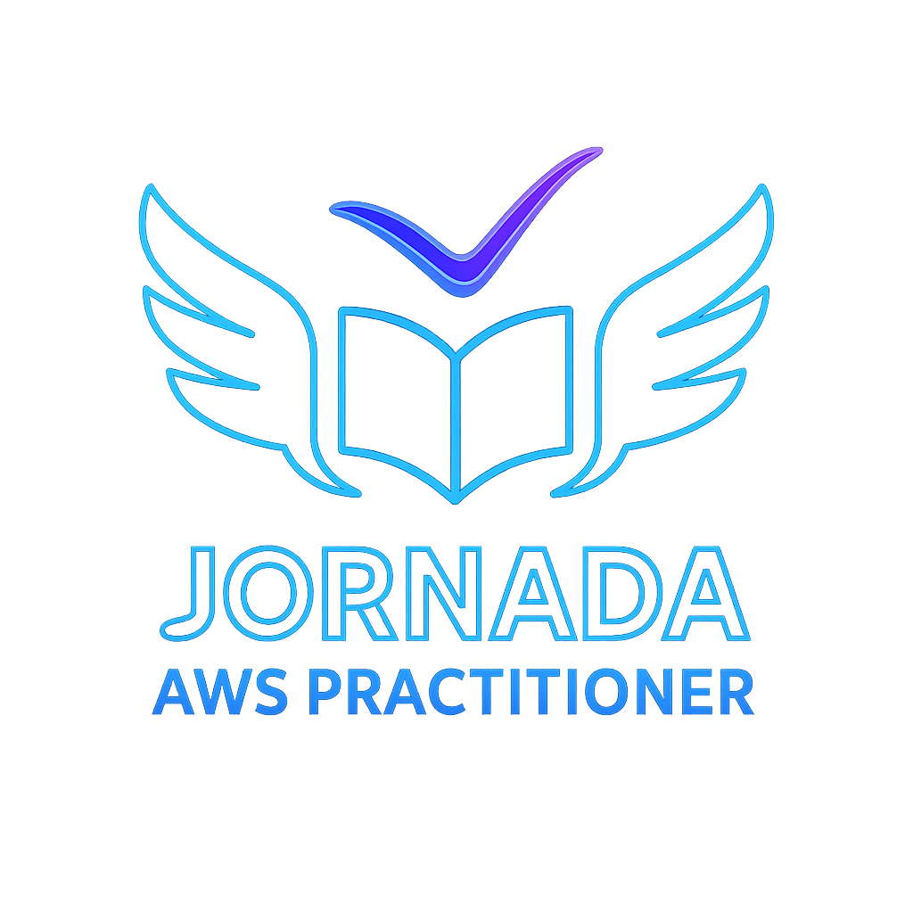

  

## Início Rápido

Navegue pelos módulos principais para começar sua jornada de aprendizado.

  <a href="./01_Cloud_Foundations/" class="card">
    <h3> Fundamentos da Cloud</h3>
    
Descubra como a nuvem transforma o mundo digital. Entenda os pilares que sustentam a AWS e outras plataformas modernas.

  </a>

  <a href="./02_Linux/" class="card">
    <h3> Dominando o Linux</h3>
    
Domine o sistema operacional que impulsiona servidores, containers e a infraestrutura da nuvem. Prático, poderoso e essencial.

  </a>

  <a href="./03_Redes/" class="card">
    <h3> Redes na Nuvem</h3>
    
Entenda como os dados trafegam com segurança e velocidade. Aprenda a criar redes escaláveis com Amazon VPC e muito mais.

  </a>

  <a href="./04_Seguranca/" class="card"> 
    <h3> Segurança na Nuvem</h3>
    
Proteja seus dados e aplicações com boas práticas, criptografia e monitoramento inteligente. Segurança é prioridade na nuvem.

  </a>

  <a href="./05_Python/" class="card">
    <h3> Python na prática</h3>
    
Automatize tarefas, analise dados e crie aplicações com Python. A linguagem que conecta desenvolvedores à nuvem.

  </a>

  <a href="./06_Banco_de_Dados/" class="card">
    <h3> Banco de Dados na Nuvem</h3>
    
Gerencie dados com escalabilidade e alta disponibilidade. Explore soluções como RDS, DynamoDB e estratégias de arquitetura.

  </a>

---

### Como Usar Este Guia

Este site foi criado para ser uma ferramenta de **aprendizado ativo e contínuo**, com foco em prática, clareza e evolução técnica.

* **Explore os Módulos:** Cada seção foi estruturada para facilitar o entendimento e aplicação dos conceitos.
* **Interaja com o Conteúdo:** Diagramas, comparações e dicas de certificação tornam o estudo mais dinâmico.
* **Acompanhe seu Progresso:** Checklists em cada módulo ajudam a visualizar sua evolução.
* **Use como Portfólio:** Compartilhe este projeto no LinkedIn ou currículo para mostrar seu comprometimento com a área de Cloud.

Se este conteúdo te ajudou, considere deixar uma ⭐ no repositório ou compartilhar com colegas.  
Seu apoio ajuda a manter o projeto vivo e em constante melhoria.

!!! quote "A Nuvem como um Serviço de Eletricidade"
    Imagine que você precisa de luz em casa. Você não constrói uma usina de energia no seu quintal, certo? Você simplesmente se conecta à rede elétrica e paga apenas pela energia que consome.
      
    **A Computação em Nuvem é a mesma ideia para tecnologia.** Em vez de comprar servidores caros, você "aluga" poder computacional da AWS pela internet e paga apenas pelo que usa. Simples assim.

---

### Sobre Este Projeto

Este guia foi desenvolvido como parte do meu aprendizado no programa **AWS re/Start**, totalizando **192 horas de aulas práticas**.  
Mais do que um compilado técnico, ele representa minha jornada de estudo contínuo, organização e dedicação para construir uma base sólida em Cloud Computing.

Este projeto é aberto a melhorias. Se quiser contribuir com sugestões, correções ou novas ideias, será muito bem-vindo!

Sinta-se à vontade para explorar, aprender e se conectar.

## 👤 Sobre Mim {#sobre}

  
  

    <h3>Renato Filho • Explorador da Nuvem</h3>
    
Sou apaixonado por tecnologia, aprendizado contínuo e por ajudar pessoas a desbravarem o universo da computação em nuvem. Este projeto nasceu da minha jornada no programa <strong>AWS re/Start</strong>, com mais de <strong>192 horas de aulas práticas</strong>, e representa minha evolução técnica, organização e dedicação ao estudo contínuo.

    
Este guia é aberto a melhorias. Se você gostou do conteúdo, considere deixar uma estrela ⭐ no repositório ou compartilhar com colegas. Toda contribuição ajuda a tornar este projeto ainda mais útil para quem está começando na nuvem.

    

      <a href="mailto:renatoservicesti@gmail.com" style="text-decoration: none;">
        
        renatoservicesti@gmail.com
      </a>
       
      <a href="https://linkedin.com/in/renato-filho-devandtech" style="text-decoration: none;">
        
        linkedin.com/in/renato-filho-devandtech
      </a>
    

  

